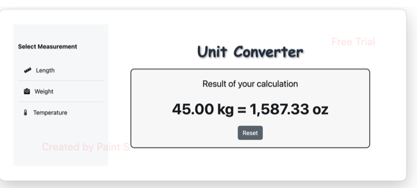

# Unit Converter

Welcome to the **Unit Converter**! This project provides a sleek, flexible, and intuitive tool to handle various unit conversions. With a friendly web interface and a powerful backend, this converter supports multiple types of conversions seamlessly. Perfect for anyone who frequently deals with diverse unit measurements and values!

## Table of Contents

- [Overview](#overview)
- [Features](#features)
- [Installation](#installation)
- [Application Walkthrough](#application-walkthrough)
- [Documentation](#documentation)
- [Dependencies](#dependencies)
- [License](#license)
- [Acknowledgement](#acknowledgement)

## Overview

The **Unit Converter** is built to handle conversions using a modular approach, making it easy to update or extend conversion options. We’ve used the **Strategy Pattern** to make adding new conversions as simple as possible. This design means we can add more conversions without altering the main application code—a big plus if you want a scalable, customizable tool!

## Features

- **Supports Multiple Units**: Convert between various unit types effortlessly.
- **User-Friendly Interface**: Simple, clean UI for easy interaction.
- **Flexible Backend**: Easily expandable to support new conversions.
- **Cross-Platform**: Use it on macOS, Windows, or Linux.

## Installation

Get started with the **Unit Converter** in a few quick steps:

1. Clone the repository and move to the project folder.
   
   ```
   git clone https://github.com/Morgan-Sell/unit_converter.git
   cd unit_converter
   ```

2. Run the setup script to install all dependencies and set up the environment:

   ```
   chmod +x run.sh
   ./run.sh initial-setup
   ```
3. Once setup completes, launch the application with:

    ```
    ./run.sh run-app
    ```

4. Open your browser and enter http://127.0.0.1:5001 into the address bar.


## Application Walkthrough
Here's a step-by-step walkthrough of the Unit Converter to help you get familiar with its features and interface.

### 1. Launching the Application
When you access http://127.0.0.1:5001 via your web browser, you'll be greeted by the home page.

<p align="center">
  
</p>

### 2. Selecting Conversion Types
The main dashboard allows you to choose from different unit categories, such as Length, Weight, and, Volume Simply select the category and input the values you wish to convert.

### 3. Entering Values and Choosing Units
Once you’ve selected a conversion type, enter your value, pick the unit to convert from, and select the unit to convert to. This intuitive form makes it easy to input data and convert units quickly.

<p align="center">
  
</p>

### 4. Viewing Results
After submitting your conversion, the result is displayed prominently, allowing you to easily view and use the converted value.

<p align="center">
  
</p>

### 5. Return to Calculator
Select **Reset** to return to the calculator. You can use the vertical navbar to select a different unit of measure to convert.

<p align="center">
  
</p>

## Documentation

The project structure is as follows:

```
├── .github/
│   └── workflows/
│       └── ci.yaml                 # GitHub Actions configuration for continuous integration
├── img/                            # Directory for storing images
├── src/                            # Main source code directory
│   ├── config.py                   # Configuration file for setting application constants
│   ├── conversion_strategy.py      # Contains conversion strategies and logic for different units
│   ├── forms.py                    # Handles user input forms and validation
│   ├── main.py                     # Main application entry point
│   ├── operations.py               # Defines utility functions
├── static/
│   └── css/                        # Static assets like CSS for styling 
├── templates/                      # HTML templates for rendering UI for Flask
├── tests/                          # Unit and integration tests for the application
├── .gitignore                      # Specifies files and directories to ignore in Git
├── LICENSE                         # License for the project
├── pyproject.toml                  # Build configuration for the project, specifying dependencies and project metadata
├── README.md                       # Project documentation and usage instructions
├── requirements.txt                # Lists Python dependencies required for the project
└── run.sh                          # Shell script for managing setup, environment, and application tasks
```

## Dependencies

- Python 3.11
- Libraries listed in `requirements.txt` (automatically installed with setup)
  

## License
This project is licensed under the MIT License. See the `LICENSE` file for more details.

## Acknowledgement
This application was built following the architecture outlined in [roadmap.sh's Unit Converter project](https://roadmap.sh/projects/unit-converter).